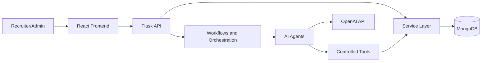

# Recruitment Assist Technical Documentation

## 1. Introduction

Recruitment Assist is a full-stack AI recruitment platform for managing clients, job descriptions, candidates, resume screening, assessments, interviews, vendors, dashboards, reports, and recruiter assistance.

The application combines a React frontend, Flask backend, MongoDB persistence layer, OpenAI-based extraction and generation, and agent/workflow modules for screening and recruiter chat.

## 2. System Overview

High-level flow:

## 3. Technology Stack

- Frontend: React 18, React Router DOM, Create React App, custom CSS, Flatpickr, jsPDF, xlsx, docx, file-saver.
- Backend: Python, Flask, Flask-CORS, Werkzeug, python-dotenv, Pydantic, pytest.
- Database: MongoDB using PyMongo.
- AI and workflows: OpenAI Python SDK, LangGraph, LangChain packages, local agents, local workflow modules, tool gateway.
- Document processing: PyPDF2, PyMuPDF, pdfplumber, python-docx.
- Communication: SMTP email and optional Twilio SMS.

## 4. Project Structure

- `frontend/src/pages`: React screens such as Dashboard, Candidates, JD details, Comparison, Interviews, Reports, Vendors, Assessments, Workflow Admin, and Profile.
- `frontend/src/components`: Shared layout, navigation, chat, and feedback components.
- `frontend/src/styles`: Page-specific and shared CSS.
- `backend/routes`: Flask API blueprints grouped by feature.
- `backend/services`: Business logic and persistence-facing helpers.
- `backend/agents`: Role-specific AI agents for JD parsing, resume parsing, matching, ranking, summaries, interviews, routing, and recruiter chat.
- `backend/tools`: Agent-accessible tools such as JD loading, resume profile creation, matching, recruiter context, and tool gateway controls.
- `backend/workflows`: Multi-step application, screening, and recruiter chat workflows.
- `backend/orchestration`: Main orchestrator, LangGraph state graph, and tracing utilities.
- `backend/assessment`: Assessment models, repositories, schemas, evaluators, and utilities.
- `scripts`: Project setup and documentation PDF generation scripts.
- `docs`: Technical PDFs, Markdown documents, and patch notes.

## 5. Backend Architecture

`backend/app.py` initializes Flask, loads environment variables, configures upload limits and CORS, registers feature blueprints, initializes MongoDB, and redirects non-API browser requests to the React frontend.

Major backend layers:

- Routes validate HTTP inputs and return JSON responses.
- Services implement business rules, persistence workflows, email/SMS handling, assessments, vendors, fulfilment, and reporting.
- Agents perform AI-assisted extraction, matching, ranking, summarization, interview content generation, and recruiter chat.
- Tools expose controlled operations to agents through reusable modules and the tool gateway.
- Database functions in `backend/database.py` centralize MongoDB access, indexes, counters, serialization, audit logs, session tokens, and dashboard metrics.

## 6. Frontend Architecture

The React frontend is a single-page application with protected routes. `frontend/src/api.js` centralizes backend communication and session token handling.

Primary screens:

- Dashboard: operational metrics, recent activity, and JD performance.
- Job descriptions: list, create, details, candidate matching, vendor assignment, and fulfilment.
- Candidates: candidate list, profile, assessment state, and repair/re-extraction support.
- Comparison: resume/JD matching workflow.
- Interviews: scheduling, follow-ups, outcomes, cancellation, email, and optional SMS.
- Assessments: assessment generation, editing, preview, candidate submission, and results.
- Vendors: vendor CRUD, JD assignments, and vendor email workflow.
- Workflow Admin: readiness, backfill, required candidate counts, category controls, and manual fulfilment overrides.
- Reports: recruitment metrics and reporting views.

## 7. Database Documentation

MongoDB collections are initialized and indexed in `backend/database.py`. Important collections include:

- `users`: login accounts and profile details.
- `user_session_tokens`: API session tokens with TTL.
- `clients` and `projects`: client/project ownership metadata.
- `job_descriptions`: parsed JD records, status, categories, workflow status, and fulfilment counters.
- `candidates`: uploaded/internal/vendor candidates, resume metadata, structured profile data, category fields, and hiring status.
- `comparisons`: JD-candidate match records, scores, summaries, selection status, and workflow metadata.
- `interviews`: interview schedule, email/SMS state, follow-up/cancellation content, and outcomes.
- `vendors`, `jd_vendor_assignments`, `vendor_email_logs`: vendor fulfilment and communication records.
- `assessments`, `questions`, `candidate_answers`, `assessment_results`: assessment lifecycle data.
- `agent_runs`: task execution records for agentic workflows.
- `audit_logs`: tamper-evident audit trail using previous/current hashes.
- `dashboard_metrics` and `counters`: cached metrics and integer ID counters.

## 8. AI and Agentic Architecture

Important agent modules:

- `router_agent.py`: determines workflow routing.
- `jd_agent.py`: loads and normalizes JD content.
- `resume_agent.py`: loads existing candidates or extracts uploaded resumes.
- `matching_agent.py`: compares JD requirements with candidate profiles.
- `ranking_agent.py`: ranks candidates by match score.
- `summary_agent.py`: builds recruiter-facing summaries.
- `interview_agent.py`: generates interview questions.
- `recruiter_agent.py`: answers recruiter chat requests and proposes controlled actions.

Important workflow/orchestration modules:

- `main_orchestrator.py`: creates run IDs, determines task type, records status, and dispatches work.
- `hr_graph.py`: graph-based HR routing and state transitions.
- `screening_workflow.py`: JD, resume, matching, ranking, and summary sequence.
- `recruiter_chat_workflow.py`: recruiter message, context retrieval, answer/action generation.
- `app_workflow.py`: controlled application workflow actions such as interview utilities.

## 9. API Reference Summary

Main API groups:

- Auth: `/api/login`, `/api/logout`, `/api/profile`.
- Dashboard and reports: `/api/dashboard`, `/api/metrics/jd-performance`, `/api/reports`, `/api/report/email`.
- Job descriptions: `/api/jds`, `/api/jds/create`, `/api/jds/<id>`.
- Candidates: `/api/candidates`, `/api/candidates/<id>`, `/api/candidates/repair`.
- Matching and fulfilment: `/api/compare`, `/api/jds/<id>/fulfilment`, `/api/jds/<id>/fulfilment/recalculate`.
- Interviews: `/api/interviews`, scheduling, email generation, follow-ups, outcomes, and cancellation endpoints.
- Assessments: generation, lookup, save draft, question CRUD, preview, email, send, candidate token, answer save, submit, and result endpoints.
- Agentic workflows: `/api/agentic/run`, `/api/agentic/screening`, `/api/agentic/runs`.
- Vendors: vendor CRUD, vendor/JD assignments, vendor email, email history, and candidate acceptance.
- Admin workflow: readiness, backfill, required count, vendor categories, bench selection override, unavailable marking, and fulfilment timeline.
- Audit: `/api/audit/logs`.

## 10. Setup and Installation

Backend:

1. Create and activate a Python virtual environment.
2. Install dependencies from `backend/requirements.txt`.
3. Configure environment variables in `backend/.env`.
4. Run the Flask backend.

Frontend:

1. Install npm dependencies in `frontend`.
2. Run the React dev server.
3. Use `frontend/src/api.js` and proxy settings to reach the Flask API.

Root project scripts also include helper commands for backend setup and running both parts of the application.

## 11. Environment Variables

Important variables include:

- `MONGODB_URI` or `MONGO_URI`
- `MONGODB_DB` or `MONGO_DB`
- `SECRET_KEY`
- `CORS_ORIGINS`
- `FRONTEND_URL`
- `OPENAI_API_KEY`
- SMTP values for email delivery
- Twilio values for optional SMS
- `SESSION_TOKEN_TTL_HOURS`
- `SEED_DEFAULT_USERS` and default user passwords when seeding local users

## 12. Security Considerations

- Passwords are stored with Werkzeug password hashing.
- API sessions use server-side MongoDB tokens with TTL.
- Upload size is capped in Flask.
- Uploaded filenames are sanitized.
- Audit logs include hash chaining.
- Tool gateway and security policy modules guard agent tool execution.
- Sensitive audit parameters are redacted before persistence.
- Production deployments should use secure cookies, restricted CORS origins, HTTPS, and managed secret storage.

## 13. Testing and Validation

Backend tests live under `backend/tests`. Current coverage includes security hardening, vendor service behavior, fulfilment service behavior, workflow admin behavior, and assessment modules.

Recommended validation:

- Run backend pytest tests.
- Run frontend build.
- Manually test login, JD upload, candidate upload, matching, assessment generation, interview scheduling, vendor assignment, workflow admin, and reports.

## 14. Deployment Guide

Production deployment should separate frontend and backend concerns:

- Build the React frontend with `npm run build`.
- Deploy Flask behind a WSGI server or managed Python platform.
- Use MongoDB Atlas or another managed MongoDB deployment.
- Store secrets outside source control.
- Configure production CORS origins and HTTPS.
- Configure upload storage and retention policy.
- Configure SMTP/Twilio credentials only in the runtime environment.

## 15. Troubleshooting

- Database unavailable: verify `MONGODB_URI`, network access, database user permissions, and Atlas IP rules.
- Login failure: verify seeded users, password hashes, and session token collection.
- Frontend cannot call backend: verify backend port, frontend proxy/API base URL, and CORS origins.
- Resume/JD parsing issues: check file type, upload folder, parser dependencies, and extraction logs.
- AI output issues: verify `OPENAI_API_KEY`, prompt inputs, and JSON parser fallbacks.
- Email/SMS failures: verify SMTP/Twilio configuration and recipient fields.

## 16. Future Enhancements

- Expand automated API reference generation.
- Add OpenAPI schema export.
- Add deployment diagrams for production infrastructure.
- Add per-collection sample MongoDB documents.
- Add end-to-end tests for recruiter workflows.
- Add PDF docs generation from this Markdown source.
